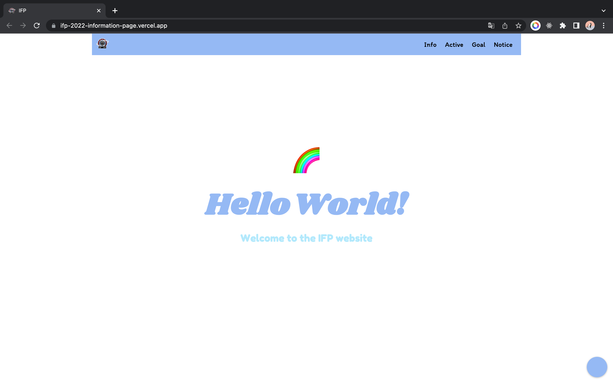
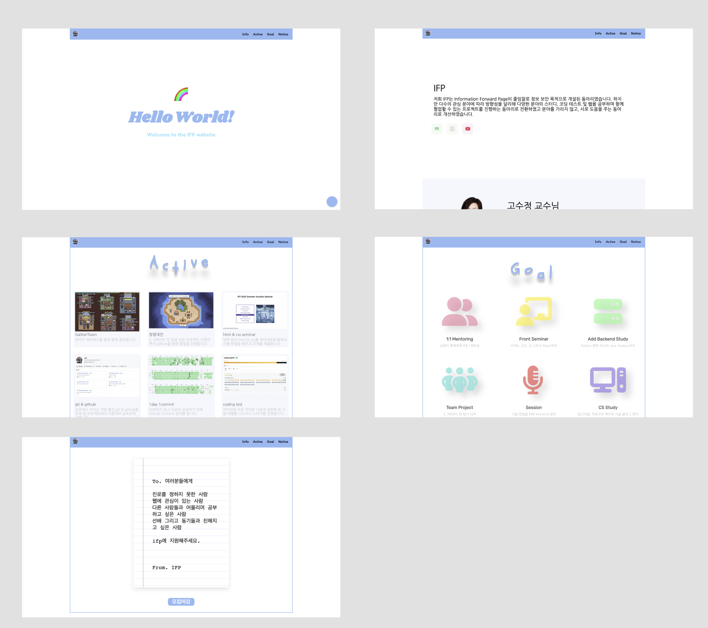

### ifp-2022-information-page

[ifp-2022-information-page](https://ifp-2022-information-page.vercel.app/)

### 📝 Description

학과 동아리에서 홍보를 위한 페이지를 만들었습니다. 페이지는 Info, Active, Goal, Notice로 구성되어 있으며 각각 교수님, 회장, 부회장, 사용중인 노션, 깃허브 organization, youtube 링크 | 진행한 스터디, 세미나, 창업대전, 게더타운 | 진행하고 싶은 세션, 멘토링 등| 모집 구글폼을 소개합니다.

### 🔍 Preview

화면 캡쳐

### **🧰 Tools**

  
  
  
  

